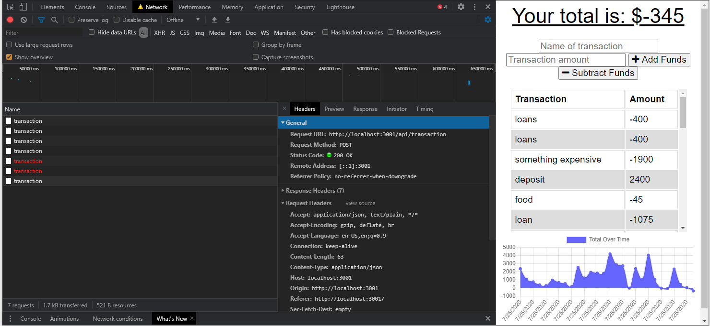
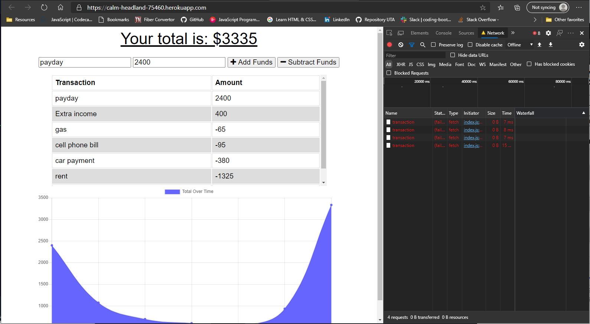

<h1 align="center">Budget Tracker</h1>

<p align="center">


## Table of Contents

* [User Story](#user-story)

* [Deployed Application](#deployed-application)

* [Usage](#usage)

* [Contributing](#contributing)

* [Questions](questions)

* [Heroku Page](#heroku-page)

* [License](#license)

## User Story

```md
AS AN avid traveller
I WANT to be able to track my withdrawals and deposits with or without a data/internet connection
SO THAT my account balance is accurate when I am traveling 
```


## Deployed Application 







## Usage

Budget tracker, it should provide the following functionality:

* The ability to enter deposits offline.

* The ability to enter expenses offline.

* Offline entries should be added to the tracker when the application is brought back online.


## Contributing

### [@GitHub](https://github.com/torreseam)
### [BudgetTracker Repo](https://github.com/torreseam/Budget-Tracker.git)


## Questions

### By ✉️ email @ torreseam.purdue@gmail.com


## Heroku Page

### [HEROKU Link](https://calm-headland-75460.herokuapp.com/) 


 ## License


  Copyright (c) 2020 BudgetTracker

  Permission is hereby granted, free of charge, to any person obtaining a copy
  of this software and associated documentation files (the "Software"), to deal
  in the Software without restriction, including without limitation the rights
  to use, copy, modify, merge, publish, distribute, sublicense, and/or sell
  copies of the Software, and to permit persons to whom the Software is
  furnished to do so, subject to the following conditions:

  The above copyright notice and this permission notice shall be included in all
  copies or substantial portions of the Software.

  THE SOFTWARE IS PROVIDED "AS IS", WITHOUT WARRANTY OF ANY KIND, EXPRESS OR
  IMPLIED, INCLUDING BUT NOT LIMITED TO THE WARRANTIES OF MERCHANTABILITY,
  FITNESS FOR A PARTICULAR PURPOSE AND NONINFRINGEMENT. IN NO EVENT SHALL THE
  AUTHORS OR COPYRIGHT HOLDERS BE LIABLE FOR ANY CLAIM, DAMAGES OR OTHER
  LIABILITY, WHETHER IN AN ACTION OF CONTRACT, TORT OR OTHERWISE, ARISING FROM,
  OUT OF OR IN CONNECTION WITH THE SOFTWARE OR THE USE OR OTHER DEALINGS IN THE
  SOFTWARE.